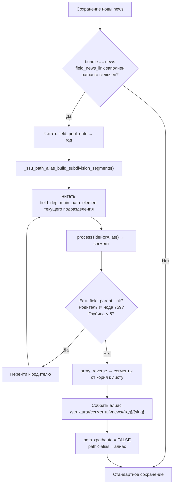

# SSU Path Alias

Модуль Drupal 9 для автоматического формирования URL-алиасов нод типа **news** на основе иерархии подразделений, года публикации и заголовка новости.

---

## Содержание

- [Назначение](#назначение)
- [Требования](#требования)
- [Установка](#установка)
- [Как это работает](#как-это-работает)
- [Требования к структуре контента](#требования-к-структуре-контента)
- [Захардкоженные значения](#захардкоженные-значения)
- [Архитектура](#архитектура)

---

## Назначение

Модуль перехватывает сохранение ноды типа `news` и автоматически формирует для неё URL-алиас по шаблону:

```
/struktura/{путь-подразделения}/news/{год}/{заголовок-slug}
```

**Пример:**

```
/struktura/fizicheskij-fakultet/kafedra-fiziki/news/2025/novoe-issledovanie
```

Путь подразделения строится рекурсивно по иерархии: модуль поднимается от указанного подразделения вверх по цепочке родителей до корневого узла «Структура» (нода 759) и собирает сегменты пути из каждого узла.

---

## Требования

| Требование | Описание |
|---|---|
| Drupal | `^9` |
| Модуль **Pathauto** | Опционально. Если установлен, используется для транслитерации и очистки строк (`pathauto.alias_cleaner`). Без него применяется встроенная транслитерация Drupal. |
| Тип контента `news` | Должен существовать с полями `field_news_link` и `field_publ_date`. |
| Тип контента для подразделений | Должен иметь поля `field_parent_link` и `field_dep_main_path_element`. |
| Корневая нода 759 | Нода «Структура» — вершина иерархии подразделений. |

---

## Установка

1. Скопируйте папку модуля в `web/modules/custom/ssu_path_alias` (или другую директорию для пользовательских модулей).
2. Включите модуль через административный интерфейс (`/admin/modules`) или с помощью Drush:

```bash
drush en ssu_path_alias -y
```

3. Убедитесь, что структура контента соответствует [требованиям](#требования-к-структуре-контента).

---

## Как это работает

### 1. Хук `ssu_path_alias_entity_presave()`

Выполняется перед каждым сохранением сущности. Логика активируется только при выполнении всех условий:

- Сущность является нодой (`NodeInterface`).
- Тип ноды — `news`.
- Поле `field_news_link` заполнено (указано подразделение).
- Для ноды включён Pathauto (`$entity->path->pathauto` не пусто).

Если все условия выполнены:

1. Читается дата публикации из `field_publ_date` — извлекается год. Если поле пустое, берётся текущий год.
2. Вызывается `_ssu_path_alias_build_subdivision_segments()` для построения сегментов пути по иерархии.
3. Формируется итоговый алиас: `/struktura/{сегменты}/news/{год}/{slug-заголовка}`.
4. Pathauto отключается для данного сохранения (`$entity->path->pathauto = FALSE`), и устанавливается готовый алиас.

### 2. Функция `_ssu_path_alias_build_subdivision_segments()`

Рекурсивно (итеративно, с защитой от зацикливания) обходит иерархию подразделений:

1. Начинает с ноды подразделения, указанной в `field_news_link`.
2. Из каждой ноды берёт значение поля `field_dep_main_path_element` — это сегмент пути данного уровня.
3. Поднимается к родительскому узлу через `field_parent_link`.
4. Останавливается, когда родителем оказывается нода 759 («Структура») или когда достигнута максимальная глубина (5 уровней).
5. Возвращает сегменты в порядке от верхнего уровня к нижнему (массив разворачивается).

**Пример иерархии:**

```
Структура (нода 759)          <- стоп
  └─ Факультет физики           field_dep_main_path_element = "fizicheskij-fakultet"
       └─ Кафедра физики         field_dep_main_path_element = "kafedra-fiziki"
```

Результат: `['fizicheskij-fakultet', 'kafedra-fiziki']`

### 3. Функция `processTitleForAlias()`

Преобразует произвольную строку (заголовок ноды или сегмент пути) в безопасный URL-slug:

**Если установлен Pathauto:**

```php
$cleaner->cleanString($title, ['separator' => '-', 'max_length' => 80, 'transliterate' => TRUE], 'ru');
```

**Если Pathauto недоступен (fallback):**

1. Транслитерация через `\Drupal::transliteration()` (язык `ru`).
2. Приведение к нижнему регистру.
3. Замена всех символов, кроме `a-z`, `0-9`, `-`, `/`, на дефис.
4. Схлопывание подряд идущих дефисов в один.
5. Обрезка дефисов с обоих концов.
6. Ограничение длины до 80 символов с обрезкой по последнему дефису.

---

## Требования к структуре контента

### Тип контента `news`

| Поле | Тип | Назначение |
|---|---|---|
| `field_news_link` | Entity reference (нода) | Ссылка на подразделение, к которому относится новость |
| `field_publ_date` | Date | Дата публикации. Из неё извлекается год для алиаса |

### Тип контента подразделения

| Поле | Тип | Назначение |
|---|---|---|
| `field_parent_link` | Entity reference (нода) | Ссылка на родительское подразделение |
| `field_dep_main_path_element` | Text (plain) | Сегмент URL для данного подразделения (на латинице) |

> Поле `field_dep_main_path_element` рекомендуется заполнять вручную латинскими символами, поскольку именно оно попадает в URL без дополнительной обработки (функция `processTitleForAlias()` всё же применяется, но лучше хранить уже чистые значения).

---

## Захардкоженные значения

| Константа | Значение | Где используется |
|---|---|---|
| ID корневой ноды «Структура» | `759` | `_ssu_path_alias_build_subdivision_segments()` — условие остановки обхода |
| Максимальная глубина иерархии | `5` | `_ssu_path_alias_build_subdivision_segments()` — защита от бесконечного цикла |
| Максимальная длина slug | `80` | `processTitleForAlias()` — ограничение длины сегмента пути |
| Префикс алиаса | `/struktura/` | `ssu_path_alias_entity_presave()` — начало формируемого алиаса |

> При изменении ID корневой ноды или максимальной глубины необходимо вручную отредактировать файл `ssu_path_alias.module`.

---

## Архитектура

### Поток данных при сохранении новости



### Структура файлов модуля

```
ssu_path_alias/
├── ssu_path_alias.info.yml   # Метаданные: имя, тип, описание, core ^9, пакет SSU
└── ssu_path_alias.module     # Вся логика модуля:
                              #   ssu_path_alias_entity_presave()
                              #   _ssu_path_alias_build_subdivision_segments()
                              #   processTitleForAlias()
```
